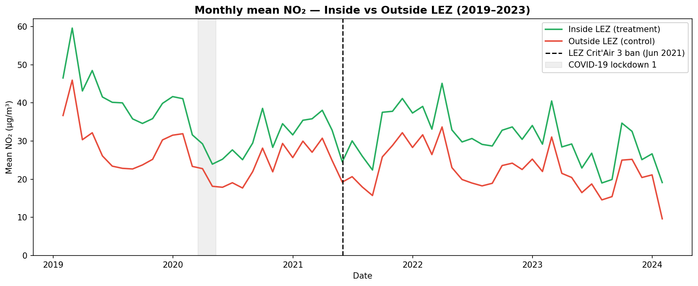
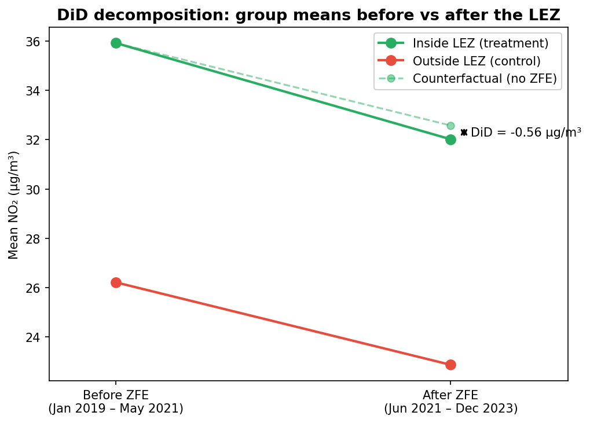
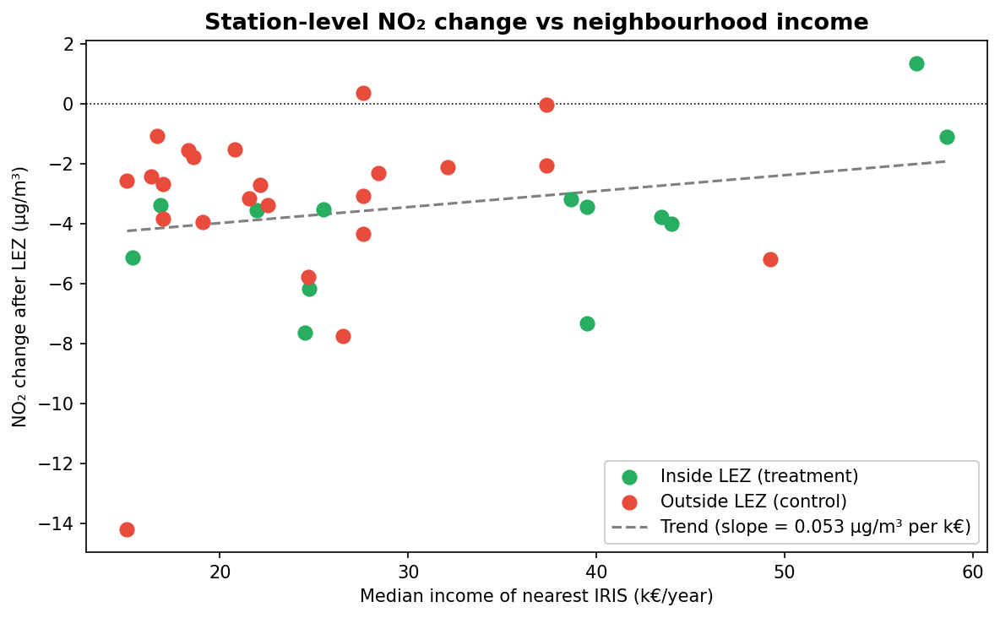
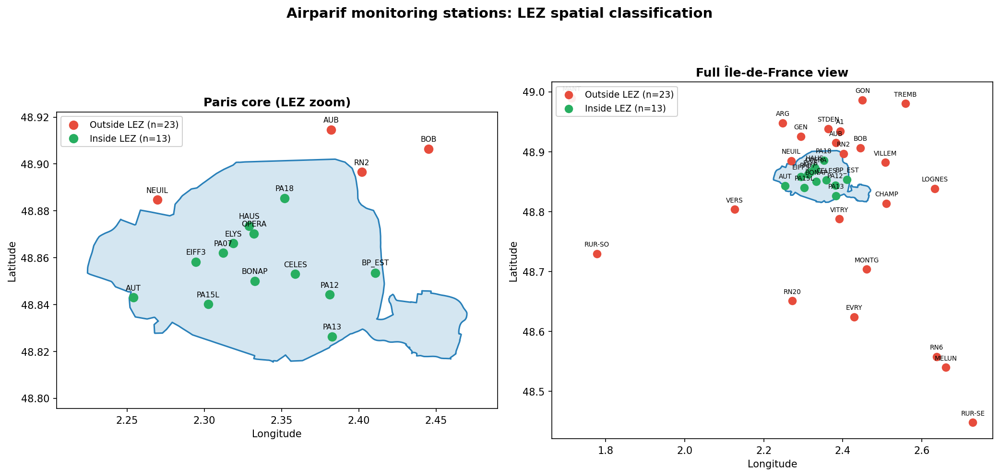

# Air Quality & Low Emission Zone — Paris NO₂ Impact Analysis

A causal inference study measuring the effect of the Paris Low Emission Zone (ZFE-m)
on NO₂ concentrations, with a socio-economic equity dimension.

---

## Research question

> Did the Paris LEZ Crit'Air 3 ban (June 2021) lead to a measurable reduction in NO₂
> concentrations at traffic-adjacent monitoring stations, and does this effect differ
> by neighbourhood median income?



*Hourly NO₂ averaged monthly, stations inside vs outside the Paris LEZ. The dashed line marks the June 2021 Crit'Air 3 ban.*

---

## Key findings

| Metric | Value |
|--------|-------|
| LEZ causal effect (DiD) | **−1.22 µg/m³** (p < 0.001) |
| General post-2021 trend | −3.49 µg/m³ across all stations |
| Income interaction (did × income_std) | +0.049 (p = 0.121, not significant) |
| R² (base model) | 0.150 |
| R² (model with income) | 0.192 |
| Panel observations | 1,518,446 (hourly, 2019–2023) |

The LEZ is associated with an additional NO₂ reduction of **1.22 µg/m³** inside the zone,
after controlling for wind speed, precipitation, and temperature.



*Decomposition of the four group means underlying the diff-in-differences. The dashed line is the counterfactual (what the inside-LEZ group would have looked like had it followed the outside-LEZ trend). The raw gap shown here (−0.56 µg/m³) is the unconditional DiD; the −1.22 µg/m³ headline figure in the table above is the regression estimate after adding weather controls.*

The income interaction is not statistically significant — the LEZ effect does not
measurably vary with neighbourhood income at this sample size.



*Per-station post-vs-pre NO₂ change plotted against the median income of the nearest IRIS. No clear monotonic relationship emerges within the 36-station sample.*

---

## Methodology

- **Design:** Difference-in-differences (DiD) with 13 treatment stations (inside LEZ)
  and 23 control stations (outside LEZ)
- **Treatment date:** June 2021 (Crit'Air 3 ban enforcement)
- **Regression:** OLS with HAC-robust standard errors (maxlags=24) to correct for
  autocorrelation in hourly time series data
- **Controls:** wind speed, precipitation, temperature (Open-Meteo API, hourly)
- **Income variable:** INSEE IRIS 2021 median disposable income, standardised (z-score),
  matched to each station via nearest-IRIS spatial join (EPSG:2154)
- **Station coordinates:** OpenStreetMap Nominatim geocoding API



*13 treatment stations (inside the LEZ perimeter) and 23 control stations (outside), Airparif network, 2019–2023.*

---

## Project structure

```
├── notebooks/
│   ├── 01_exploration.ipynb    # Data discovery: Airparif, ZFE, INSEE, weather
│   ├── 02_cleaning.ipynb       # NaN treatment, interpolation, processed exports
│   └── 03_analysis.ipynb       # Spatial classification, temporal trends, DiD, income
├── src/
│   ├── data_loader.py          # Centralised loading functions for all datasets
│   └── cleaning.py             # Reusable cleaning pipeline (Airparif, INSEE)
├── data/
│   ├── raw/                    # Source files (gitignored, 148 MB)
│   └── processed/              # Cleaned exports: airparif_clean, meteo_clean, insee_iris_clean
├── outputs/                    # Generated figures (committed for portfolio visibility)
├── requirements.txt
└── README.md
```

---

## Data sources

| Dataset | Source | Coverage |
|---------|--------|----------|
| NO₂ hourly measurements | [Airparif](https://www.airparif.fr/) | 36 stations, 2019–2023 |
| LEZ perimeter | [data.gouv.fr](https://www.data.gouv.fr/) | Paris ZFE-m GeoJSON |
| IRIS median income | [INSEE](https://www.insee.fr/) | Île-de-France, 2021 |
| Weather controls | [Open-Meteo API](https://open-meteo.com/) | Paris, hourly, 2019–2023 |
| IRIS geographic contours | [IGN](https://geoservices.ign.fr/) | France, 2024 edition |

---

## How to run

### 1. Environment

```bash
# Create and activate the virtual environment
python -m venv zfe-env
source zfe-env/bin/activate      # Windows: zfe-env\Scripts\activate

# Install dependencies
pip install -r requirements.txt
```

### 2. Download raw data

Raw data is not redistributed (148 MB, some sources require an explicit download
step). The three target folders already exist in the repo (`data/raw/airparif/`,
`data/raw/zfe_perimetres/`, `data/raw/insee_iris/`) — you only drop the downloaded
files into them. `src/data_loader.py` expects the exact filenames shown below.

#### Airparif — hourly NO₂

Portal: [data-airparif-asso.opendata.arcgis.com](https://data-airparif-asso.opendata.arcgis.com/) ·
On each dataset page below, click **Download**. The portal returns the file
**without a file extension** — rename it to `{year}_NO2.csv` (add the `.csv`
yourself) and drop it in `data/raw/airparif/`.

| Year | Dataset page |
|------|------|
| 2019 | [2019 NO2](https://data-airparif-asso.opendata.arcgis.com/datasets/6ac940f634c7422999bd3630b7359598) |
| 2020 | [2020 NO2](https://data-airparif-asso.opendata.arcgis.com/datasets/0804fd34322d4ab38092a30632de7262) |
| 2021 | [2021 NO2](https://data-airparif-asso.opendata.arcgis.com/datasets/8e17ad8f58204ea787a3bdfcf37903c3) |
| 2022 | [2022 NO2](https://data-airparif-asso.opendata.arcgis.com/datasets/0da367910c13407288d75b5e2e93d11f) |
| 2023 | [2023 NO2](https://data-airparif-asso.opendata.arcgis.com/datasets/3b7c61c20abf453a81e610e264ed91c0) |

#### ZFE perimeter — Paris

Direct GeoJSON (1 click):
[zone-a-faibles-emissions.geojson](https://opendata.paris.fr/api/explore/v2.1/catalog/datasets/zone-a-faibles-emissions/exports/geojson) →
save to `data/raw/zfe_perimetres/zone-a-faibles-emissions.geojson`.

#### INSEE — FiLoSoFi 2021 IRIS disposable income

Direct CSV-ZIP:
[BASE_TD_FILO_IRIS_2021_DISP_CSV.zip](https://www.insee.fr/fr/statistiques/fichier/8229323/BASE_TD_FILO_IRIS_2021_DISP_CSV.zip) →
unzip into `data/raw/insee_iris/` (keeps `BASE_TD_FILO_IRIS_2021_DISP.csv`).

#### IGN — CONTOURS-IRIS shapefile (2024-01-01, Lambert 93)

Direct archive (~250 MB compressed, .7z):
[CONTOURS-IRIS_3-0__SHP_LAMB93_FXX_2024-01-01.7z](https://data.geopf.fr/telechargement/download/CONTOURS-IRIS/CONTOURS-IRIS_3-0__SHP_LAMB93_FXX_2024-01-01/CONTOURS-IRIS_3-0__SHP_LAMB93_FXX_2024-01-01.7z) →
extract the full folder tree as-is into `data/raw/insee_iris/`. The shapefile
ends up at `data/raw/insee_iris/CONTOURS-IRIS_3-0__SHP_LAMB93_FXX_2024-01-01/.../CONTOURS-IRIS.shp`
(deep IGN delivery structure — don't flatten it, `load_iris_contours()` expects this path).

#### Expected structure when done

```
data/raw/
├── airparif/
│   ├── 2019_NO2.csv … 2023_NO2.csv                 (5 files, downloaded above)
│   └── stations_metadata.csv                       (included in the repo — geocoded coords)
├── zfe_perimetres/
│   └── zone-a-faibles-emissions.geojson
└── insee_iris/
    ├── BASE_TD_FILO_IRIS_2021_DISP.csv
    └── CONTOURS-IRIS_3-0__SHP_LAMB93_FXX_2024-01-01/
        └── … (full IGN folder tree)
```

### 3. Run the notebooks

```bash
jupyter notebook
```

Open and run the notebooks in order: `01_exploration` → `02_cleaning` → `03_analysis`.
Notebook 02 generates `data/processed/`; notebook 03 generates the figures in `outputs/`
and prints the final DiD coefficient (**−1.22 µg/m³**, p < 0.001).

---

## Limitations

1. **Low station count (n=36):** limits statistical power for interaction effects
2. **Single weather point:** one Open-Meteo location for all stations; outer stations may differ
3. **No station fixed effects:** unobserved station-level characteristics may bias estimates
4. **IRIS income proxy:** neighbourhood income ≠ income of drivers on nearby roads
5. **Station geocoding:** coordinates retrieved via Nominatim; precision affects spatial joins
6. **COVID-19 confounding in the pre-treatment baseline:** the pre-ZFE window (2019–2021) includes
   the French lockdowns of 2020 (March–May, October–December) and early 2021 (April–May), during
   which traffic dropped 50–80%. This depresses the pre-ZFE NO₂ baseline and may bias the DiD
   estimate. Lockdown periods are visible in the time series but are not explicitly excluded
   from the model.

---

## Stack

Python · pandas · geopandas · statsmodels · matplotlib · seaborn · Jupyter
